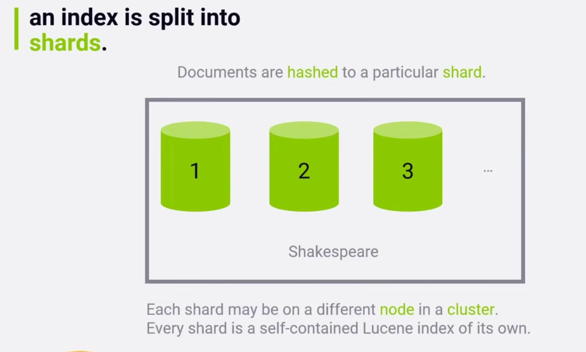
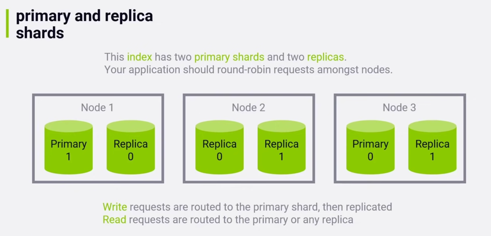
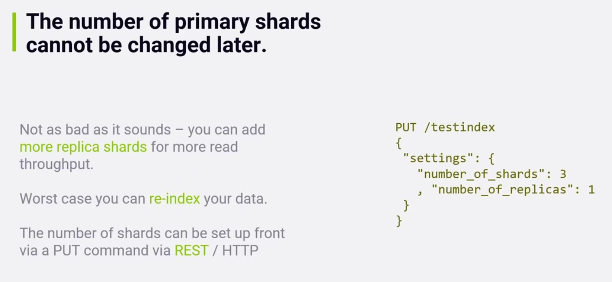
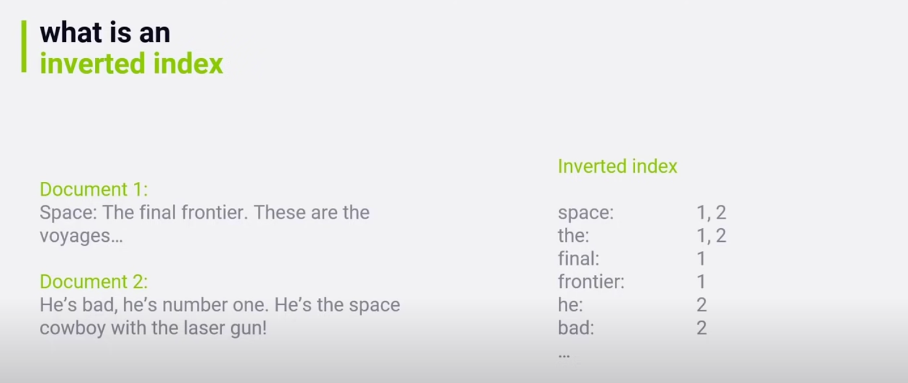

# Elasticsearch Basics

Basic concepts and examples for working with Elasticsearch.

## Tutorials

Quick and easy, basic concepts: https://www.youtube.com/watch?v=C3tlMqaNSaI

# What Is It?

Elasticsearch is a modern search and analytics engine, which is based on Apache Lucene. It is open source, built with Java, and is a NoSQL database. This means it stores data in an unstructured way. While Elasticsearch is a NoSQL database, it also has a strong focus on search capabilities and features.

## Elastic Stack

## Architecture and Scaling

# Key Concepts

## Documents

Documents are the things you are searching for. They can be more than text - any structured JSON data works. Every document has a unique ID, as well as a type.

This can be thought of as a row in a relational database.

## Types

A type defines the schema and mapping shared by documents, which represent the same sort of thing. For example, a log entry, an encyclopedia article, etc.

This can be thought of as a table in a relational database.

## Indices

An index powers search into all documents within a collection of types. They contain inverted indices, that let you search across everything within them, all at once.

This can be thought of as a relational database.

### Inverted Indices

Inverted index does not store the document text directly, instead it would split each document up into individual search terms (or words, in most cases). Then it maps each search term to the document those search terms occur within (and the position within the document!).

## Frequencies

For finding a given term, tries to give back results in the order of their relevancy, where relevancy is loosely based on TF-IDF. For example, the word 'space', in an article about space would rank very highly, however the word 'the' would not, as it is common across all documents in an index.

**TF-IDF** means Term Frequency \* Inverse Document Frequency

**Term Frequency** is how often a term appears in a **given document**

**Document Frequency** is how often a term appears in **all documents**

**Term Frequency / Document Frequency** measures the **relevance** of a term in a document, same as TF-IDF

# Using Indices

## REST API

Elasticsearch fundamentally works via HTTP requests and JSON data. Any language or tool that can handle HTTP can use Elasticsearch

## Client API's

Most languages have specialized Elasticsearch libraries to make it even easier. For example, Python has a package called elasticsearch, which can be installed with pip.

## Analytic Tools

Web-based graphical UIs such as Kibana let you interact with your indices, and explore them without writing code
